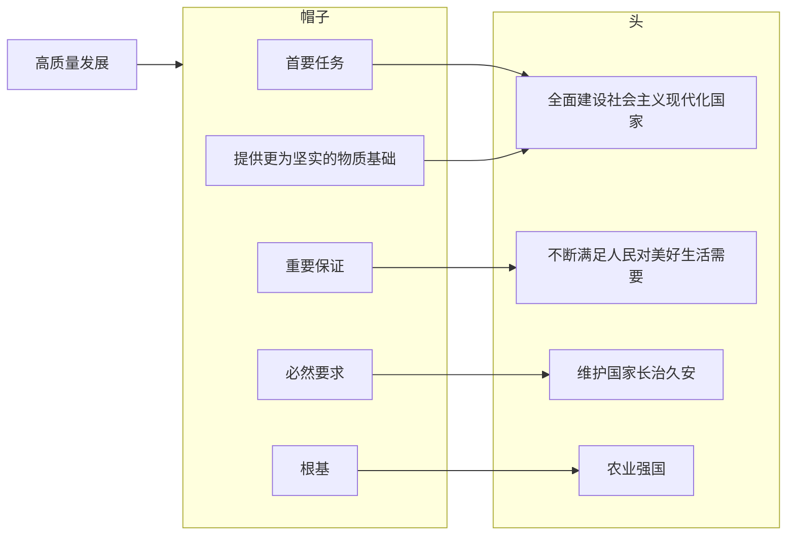
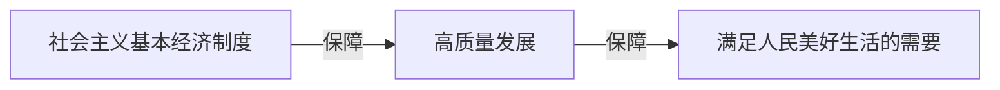

```mermaid
flowchart LR

m["高质量发展"]

subgraph "帽子"
	direction TB
	hat1["首要任务"]
	hat2[提供更为坚实的物质基础]
	hat3[重要保证]
	hat4[必然要求]
	hat5[根基]
end

subgraph "头"
	direction TB
	man1[全面建设社会主义现代化国家]
	man2[不断满足人民对美好生活需要]
	man3[维护国家长治久安]
	man4[农业强国]
end

m-->帽子
hat1-->man1
hat2-->man1
hat3-->man2
hat4-->man3
hat5-->man4
```

```mermaid
flowchart LR
n1[社会主义基本经济制度]
n2[高质量发展]
n3[满足人民美好生活的需要]
n1--保障-->n2--保障-->n3
```
