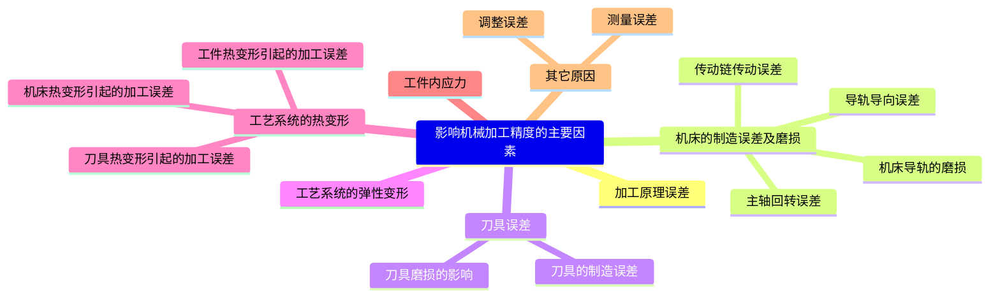

# 第一章 汽车制造工艺过程的基本概念

## 1.1 汽车的生产过程和工艺过程

### 1.1.2 汽车的工艺过程

#### 1. 工序

人工作地（或一台设备），对一个（或同时对几个）工件所连续完成的那一部分工艺程。

划分工序的标志是操作者、工作地点和加工对象是否变动。

工序是工艺过程的基本单元，是制订和计算设备负荷、工具消耗、劳动定额、生产计划和经济核算等工作的依据。

#### 2. 安装

安装是指在一个工序中，工件在机床上相对刀具进行的定位和夹紧一次所完成的那一部分工艺过程。

安装的目的就是使工件在机床上相对于刀具占有一个正确的加工位置。

#### 3. 工位

工位是指工件在一次安装中，工件在机床上相对于刀具占有的每一个加工位置。在一次安装中可以使工件占有多个加工位置。

# 第三章 工件的定位和机床夹具

## 3.2 机床夹具的组成及分类

### 3.2.1 机床夹具的组成

1. 定位元件
2. 夹紧装置
3. 对刀元件
4. 夹具连接单元
5. 夹具体
6. 其他装置

## 3.3 工件在机床夹具中的定位

### 3.3.1 六点定位原理

**六个支承点**完全限制了刚体的六个自由度，工件既不能移动，也不能转动，刚体在空间的位置是确定的。由此可见，要使工件完全定位就必须限定工件在空间的六个自由度，这一定律就称为“**六点定位原则**”。

### 3.3.3 工件正确定位与自由度的关系

1. **完全定位**：若工件在夹具中定位时，六个自由度都被限制，则称为完全定位。
2. **不完全定位**：若工件在夹具中定位，六个自由度没有被完全限制，但能满足加工要求，这种方法称为不完全定位。不需完全定位的加工工序中，采用完全定位固然可以，但增加了夹具的复杂程序。在机械加工中，一般为了简化夹具的定位元件结构，只要对影响本工序的加工尺寸的自由度加以限制即可。
3. **欠定位**：根据工件加工要求，应该限制的自由度没有被完全限制的情况称为欠定位。欠定位无法保证加工要求，因此，在确定工件在夹具中的定位方案时，**绝不允许有欠定位的现象产生**。
4. **过定位**：工件在夹具中，如果某一自由度被限制两次或两次以上，这种定位方式被称为过定位或重复定位。过定位一般会造成如下不良影响：
	1. 使接触点不稳定，增加了同批工件在夹具中位置不同一性；
	2. 增加了工件和夹具的夹紧变形；
	3. 导致部分工件不能顺利与定位元件定位；
	4. 干扰了设计意图的实现。

通常情况下应尽量避免或减少过定位现象。

## 3.6 工件的夹紧和夹紧装置

### 3.6.1 对夹紧装置的基本要求

1. 夹紧时，不能破坏工件在定位时所处的正确位置。
2. 夹紧力大小要适当，应使工件在加工中的位置稳定不变、振动小，又要使工件不产生过大的夹紧变形和表面损伤。
3. 夹紧机构的复杂程度、工作效率应与生产类型相适应，尽量做到结构简单，操作简便、安全，便于制造和维护。
4. 具有良好的自锁性能。

### 3.6.3 夹紧力的确定

#### 1. 夹紧力作用点的选择原则

1. 夹紧力的作用点应正对支承元件或支承元件所形成的支承面内，以保证工件已获得的定位保持不变。若夹紧力的作用点落在定位元件的支承范围之外，夹紧时将会破坏工件的定位。
2. 夹紧力的作用点应处于工件刚性较好的部位或使夹紧力均匀分布，以减小工件的夹紧变形。这一原则对刚性差的工件特别重要。夹紧薄壁箱体时，夹紧力应作用在刚性较好的凸边上。箱体没有凸边时，可将单点夹紧改为三点夹紧，从而改变着力点的位置，降低着力点的压强，减小工件的夹紧变形。
3. 夹紧力的作用点应尽量靠近加工部位，以减小切削力对夹紧点的力矩，防止工件的振动或变形。

#### 2. 夹紧力方向的选择原则

1. 夹紧力的方向不应破坏工件的准确定位。
2. 主要夹紧力的方向应指向工作主要定位基准面，以保证工件的加工要求。
3. 夹紧力的方向应尽量与工件刚度最大的方向相一致，以减小工件的夹紧变形。
4. 夹紧力的方向应利于减小所需的夹紧力。

#### 3. 夹紧力大小的估算

夹紧力的方向和作用点确定后，还需合理确定夹紧力的大小。夹紧力不足，会使工件在切削过程中产生位移并容易引起振动；夹紧力过大又会造成工件或夹具不应有的变形或表面损伤。因此应对所需夹紧力进行估算。

# 第四章 工件的机械加工质量
## 4.2 影响机械加工精度的主要因素

### 4.2.2 机床的制造误差及磨损

#### 2. 主轴回转误差

机床主轴是安装刀具或工件的基准。主轴回转误差即主轴实际回转轴线相对理论回转轴线的偏离（即漂移）。它可以分解成三种基本形式，即**径向圆跳动（径向漂移）**、**轴向窜动（轴向漂移）**和**角度摆动（角向漂移）**

### 4.2.4 工艺系统的弹性变形

#### 2. 机床的刚度及其对加工精度的影响

1. **配合零件的接触刚度**：零件接触表面抵抗因外力而产生变形的能力称为接触刚度。机械加工后零件的表面并非理想的平整和光滑。装配后零件间的实际接触面积也只是一小部分，且仅是这一小部分中的表面粗糙度中的个别凸峰。在外力作用下，这些接触点产生了较大的接触应力，因而有较大的接触变形。在这些接触变形中，不但有表面层的弹性变形，还有局部的塑性变形，造成了部件的刚度曲线不呈直线而呈复杂的曲线。接触表面塑性变形及接触面间存在着油膜是造成残余变形的原因。经过几次加载后才能使冷硬等现象逐渐消除（该现象在滑动轴承副中最为明显）。
2. **机床零件本身的刚度**：在部件中，个别薄弱零件对部件刚度的影响很大。例如机床燕尾槽导轨中，它常用楔铁来补偿导轨间的间隙，因为楔铁薄而长，自身刚度很差，同时制造不可能达到理想的准确程度，所以它们接触不良，在外力的作用下产生很大的变形，致使部件刚度大幅下降。
3. **连接件的刚度**：机床零件间常用螺栓连接，如果所受载荷小于螺栓压紧力产生的摩擦力时，该结构是一个整体，刚度很高。但当所受载荷超过螺栓压紧力产生的摩擦力时，零件间产生位移，即降低了刚度。
4. **零件间的间隙**：零件间的问隙也影响机床的刚度。此时主要表现在加工时载荷方向经常改变的镗床、铣床等机床上。当载荷方向改变时，间隙所引起的位移破坏了原来刀具与加工表面间的准确位置关系，因此影响很大。而对于单向受力，使工件始终靠一边的加工方式，这种影响就小得多。为此，在切削加工前应先将机床空运转一段时间，使机床零件发生热膨胀，以减小间隙，可提高机床的刚度。

### 4.2.8 工件加工误差的合成
#### 1. 加工误差的性质
1. 系统性误差
2. 随机性误差
#### 2. 加工误差的分析计算
1. 计算法
2. 统计分析法
## 4.7 机械加工过程中的振动
### 4.7.1 受迫振动（强迫振动）
#### 1. 受迫振动及其特点
受迫振动是在外界周期性干扰力作用下引起的振动。由于周期性干扰力所做的功补充了系统阻尼消耗的能量，故振动不会衰减。受迫振动的主要特点如下：
1. 受迫振动是在外界周期性干扰作用下产生的，也随外来干扰力的消失而消失，振动本身不能引起干扰力的变化。
2. 受迫振动的频率总是与外界干扰力的频率相同，一般振动频率为十几到100Hz。
3. 当干扰力的频率与工艺系统的固有频率的比值等于或接近于1时，将发生共振现象，振幅达到最大值。
4. 受迫振动的振幅与干扰力、工艺系统刚度以及阻尼大小有关。干扰力越大、刚度和阻尼越小，则振幅越大。
#### 2. 引起受迫振动的原因
受迫振动的振源可来自机床内部，称为机内振源，也可来自机床外部，称为机外振源。其产生的原因如下：
1. 由机外振源通过地基引起的报动。如邻近锻压设备、压力机、刨床和通道上的汽车等的强烈振动，通过地基传给机床。
2. 机床传动零件的缺陷。例如齿轮精度不高，传动时产生冲击；滚动轴承的误差除引起噪声外，还引起机床主轴系统的振动；平带的接缝不良、V带的厚薄不匀都会引起振动。
3. 工艺系统各旋转零件和工件不平衡。例如，没有平衡好的砂轮、带轮、卡盘、花盘和工件等，当高速回转时，会因离心力方向的周期性变化引起而振动。
4. 切削不连续。例如，端铣、刨、插加工，断续车削，以及砂轮硬度不匀和砂轮局部堵塞等，都会形成周期性变化的切削力，从而引起振动。
#### 3. 消除或减小受迫振动的途径
查明并清除（或隔离）外界周期性干扰力，是消除受迫振动的最有效方法。提高工艺系统刚度、增强阻尼，也可收到减振效果。
1. **隔振**：防止振动向刀具和工件传递。对机外振源可用橡胶垫或在机床基础四周挖防振沟阻止振源传入；或将有振源的设备隔离，防止振源外传；对机内本身的振源，也可采取隔离的办法，如将外圆磨床上的电动机通过隔振衬垫与机床弹性连接。
一般情况下，应使锻压设备、压力机等远离切削加工机床，粗加工机床远离精加工机床。
2. **消除或减小机内的干扰力**：例如，平衡好电动机转子、砂轮以及所有转速在600r/min以上的机件、夹具和工件；断续切削时增加刀具同时工作的次数或降低切削用量；磨削时合理选择砂轮的粒度和组织，以消除砂轮因堵塞而引起的振动。
3. **提高机床系统刚度和阻尼**：加强机床与地基的连接以提高刚度。例如，调整轴承间隙和零部件之间的间隙以提高刚度；
4. **改变振源频率**：使其远离机床系统的固有频率，避免出现共振现象。例如，改变铣床转速和刀齿数；采用不同齿距的铣刀或从镶片铣刀中取出若干刀齿等，往往可以改变振动频率，使其不出现共振。

# 第五章 机械加工工艺规程的制定

## 5.1 概述

### 5.1.2 制定机械加工工艺规程的原始资料和步骤

#### 2. 制订机械加工工艺规程的步骤

1. **分析研究产品的装配图和零件图**。
	1. 熟悉产品的性能、用途、工作条件，明确各零件的装配位置及其作用。
	2. 对装配图和零件图进行工艺性审查。
2. **确定毛坯**。毛坯质量高，则切削加工量小，可提高材料利用率，降低机械加工成本。
3. **拟订工艺路线**。在拟订工艺路线时，要进行的主要工作是合理安排各表面、确定各表面的加工方法、划分加工阶段、确定工序集中与分散的程度、合理安排各表面的加工顺序等。
4. **确定各工序的设备、刀具、夹具、量具和辅助工具等**。
5. **确定各工序的加工余量，计算工序尺寸及其公差**。
6. **确定切削用量及工时定额**。
7. **确定各工序的技术要求及检验方法**。
8. **编制工艺文件**。

## 5.2 机械加工工艺路线的制定

### 5.2.1 定位基准的选择

#### 1. 粗基准的选择原则

1. **选择主要工作表面及加工面积较大的表面作为粗基准**，可以保证这些主要工作表面的加工余量均匀，也尽量保留了主要工作表面质量较高的表层。
2. **选择零件上不加工表面为粗基准**，可以保证加工面可不加工面乏向有较正确的相互位置精度。
3. 如果工件上有好几个不加工的表面，则应**以其中与加工表面的位置精度要求较高的表面作为粗基准**，以求壁厚均匀、外形对称等。
4. 如果零件的表册全需需要加工，而灶毛坯比较精确，则应该**选择加工余量最少的表面作为粗基准**。
5. 选作粗基准的表面应尽可能平整、光洁，无飞边、毛刺，以便定位准确、加紧可靠。
6. **粗基准一般只能使用一次**。粗基准的定位精度很低，所以粗基准在同一尺寸方向上只允许使用一次；否则定位误差太大。

#### 2. 精基准的选择原则

选择精基准时，主要考虑的问题是如何减少加工误差，提高定位精度。

1. **基准重合原则**：即应尽可能选择被加工面的设计基准作为该加工表面的定位基准，以避免再基准不重合而开起定位误差。特别是在最后精加工时，为保证加工精度，更应注意这一原则。
2. **基准统一原则**：在零件加工的整个工艺过程或有关的某几道工序中尽可能采用同一个（或同一组）定位基准来定位，称为基准统一原则。
3. **互为基准、反复加工原则**：例如加工精密齿轮时，齿面经高频淬火后有变形，必须进行磨削加工，因为其淬硬层较薄，应使磨削余量小而均匀，所以要先以齿面为定位基准磨削内孔，再以精磨后的内孔为定位基准磨削齿面，以保证齿面磨削余量均匀。
4. **自为基准原则**：有些精加工工序要求加工余量小而均匀，以保证加工质量和提高生产率，这时就以加工面本身作为精基准，称为自为基准。
5. **所选用的定位基准应能保证工件的装夹稳定可靠、夹具结构简单、操作方便**。

### 5.2.3 加工阶段的划分

**零件的加工质量要求较高时**，必须把整个加工过程划分为以下几个阶段。

1. **粗加工阶段**：在这一阶段中要切除大量的加工余量，如何提高生产率是该阶段主要考虑的问题。
2. **半精加工阶段**：在这一阶段中应为主要表面的精加工做准备，使其达到一定的加工精度并保证精加工时的加工余量，同时完成一些次要表面的加工，如连接孔的钻孔、攻螺纹、铣键槽等工序。它一般在热处理之前进行。
3. **精加工阶段**：保证各主要表面达到图样规定的质量要求。
4. **光整加工阶段**：对于尺寸公差等级要求很小（≤IT6）、表面粗糙度Ra值要求很小（≤0.20μm）的零件，要进行专门的光整加工。

#### 加工阶段的划分的优点：

1. **有利于保证加工质量**。粗加工时，由于切去的加工余量大，则所需的夹紧力和切削力也要很大，因此工艺系统的受力变形相应地增大，当工件刚性较差时更为严重。同时粗加工时切削温度高，工艺系统的热变形较大。另外，毛坯存在着内应力，粗加工时工件表面被切去较大一层金属，内应力重新分布而使工件产生变形，因此不可能达到小的尺寸公差等级和表面粗糙度值。工件需要先完成各表面的粗加工，再通过半精加工和精加工逐步减小切削用量、切削力和切削热，逐步修正工件的变形，减小尺寸公差等级和表面粗糙度值，最终达到零件图样的要求。各加工阶段之间的时间间隔相当于自然时效处理，有利于消除工件的内应力，使工件有变形的时间，以便在后一道工序中加以修正。
2. **有利于合理地使用机床设备**。粗加工可用刚度大、功率大、精度低的机床；精加工时使用精密机床，由于此时切削力小，有利于长时间地保持机床的精度。
3. **粗加工安排在前，可及早发现毛坯的缺陷（如铸件的气孔、砂眼等），以免继续加工造成工时的浪费。**
4. **为了在机械加工工序中插入必要的热处理工序，同时使热处理发挥充分的效果，就自然地要求把机械加工工艺过程划分为几个阶段，而每个阶段各有其特点及应达到的目的。**
5. **精加工工序安排在最后，可有效地使精加工后的表面不受或少受损伤。**

### 5.2.5 加工工序、热处理工序和辅助工序的安排

#### 1.加工工序的安排

在安排加工工序时，一般应遵循以下几个原则：

1. **基面先行**：即工件刚开始进行加工时，总是先精基准面加工来，在此基础上再进行其他表面的加工。
2. **先粗后精**：即加工工序的安排顺序为粗加工、半精加工、精加工和光整加工。
3. **先主后次**：即先安排主要表面的加工，后安排次要表面的加工。主要表面一般是指装配基准面、工作表面等；而次要表面是指非工作表面（如紧固用的光孔、键槽和螺纹孔等）。
4. **先面后孔**：当有平面和内孔表面要加工时，一般先加工平面后加工孔。

一般零件的加工顺序：
1. 精基准的加工
2. 主要表面的粗加工
3. 主要表面的半精加工和次要表面的加工
4. 热处理
5. 主要表面的精加工
6. 检验

#### 2.热处理工序的安排

热处理主要用来改善材料的性能和消除内应力。一般热处理工序在工艺过程中的安排如下：

1. 为改善金属的组织和加工性能而进行的预备热处理，如退火、正火等，一般安排在机械加工之前。
2. 为消除内应力而进行的时效处理工序，常安排在粗加工之后、精加工之前，或在各加工阶段之间安排几次，应根据零件的加工要求和刚性而定。
3. 为提高零件的力学性能而进行的最终热处理，如淬火、渗氮等，一般应安排在工艺过程的后期，但在该表面的最终加工之前。
4. 装饰性热处理如发蓝等，一般安排在工艺过程的最后进行。

# 第六章 尺寸链原理与应用

## 6.1 尺寸链的基本概念

### 6.1.3 尺寸链的组成

#### 1. 环

列入尺寸链中的每一个尺寸。

#### 2.封闭环

封闭环是尺寸链中在装配过程或加工过程间接得到或最后形成的一环。在一个尺寸链中，封闭环既不可多，又不可缺，只能有一个。

一般封闭环是设计尺寸，且误差相较于其他尺寸较大。

#### 3.组成环

组成环是尺寸链中对封闭环有影响的所有环。组成环的尺寸是直接保证的，它又影响封闭环的尺寸，根据组成环对封闭环的影响不同，组成环又可分为增环和减环。

#### 4.增环

增环是尺寸链中的组成环，由于该环的变动引起封闭环**同向变动**，仰在其他组成环不变的条件下，此环**增大**时，封闭环随之**增大**。

#### 5.减环

减环是尺寸链中的组成环、由于该环的变动引起封闭环**反向变动**。即在其他组成环不变的条件下，此环**增大**时，封闭环随之**减小**。

#### 6.补偿环

尺寸链中预先选定的某一组成环，可以通过改变其大小或位置，使封闭环达到规定要求。

