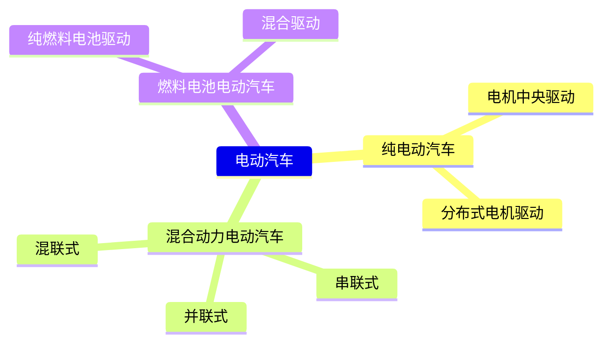

# 汽车的动力性

汽车的动力性系指汽车在良好路面上直线行驶时由汽车受到的纵向外力决定的、所能达到的平均行驶速度。

## 汽车动力性指标

从获得尽可能高的平均行驶速度的观点出发，汽车的动力性主要可由三方面的指标来评定，即：

1. 汽车的最高车速 $u_{amax}$
2. 汽车的加速时间 $t$
3. 汽车的最大爬坡度 $i_{max}$

### 最高车速

最高车速是指在水平良好的直线道路（混凝土或沥青）上汽车能达到的最高行驶稳定车速。

### 加速时间

汽车的加速时间表示汽车的加速能力，它对平均行驶车速有着很大影响，特别是轿车，对加速时间更为重视。常用==原地起步加速时间==与==超车加速时间==来表明汽车的加速能力。

#### 原地起步加速时间

原地起步加速时间指汽车由Ⅰ档或Ⅱ档起步，并以最大的加速强度（包括选择恰当的换档时机）逐步换至最高档后到某一预定的距离或车速所需的时间。

#### 超车加速时间

超车加速时间指用最高档或次高档由某一较低车速全力加速至某一高速所需的时间。

### 最大爬坡度

汽车的上坡能力是用满载（或某一载质量）时汽车在良好路面上的最大爬坡度 $i_{max}$ 表示的。

# 汽车的驱动力与行驶阻力

## 汽车的驱动力

汽车发动机产生的转矩，经传动系传至驱动轮上。此时作用于驱动轮上的转矩 $T_t$ ，产生一个对地面的圆周力 $F_0$ ，地面对驱动轮的反作用力 $F_t$ ，（方向与 $F_0$ 相反）即是驱动汽车的外力，此外力称为汽车的驱动力。其数值为$$F_t=\frac{T_t}{r}$$式中， $T_t$ 为作用于驱动轮上的转矩； $r$ 为车轮半径。

### 发动机外特性曲线

如将发动机的功率 $P_e$ 、转矩 $T_{tq}$ 以及燃油消耗率 $b$ 与发动机曲轴转速 $n$ 之间的函数关系以曲线表示，则此曲线称为发动机转速特性曲线，或简称为发动机特性曲线。

- 如果发动机节气门全开（或高压油泵在最大供油量位置），则此特性曲线称为**发动机外特性曲线**
- 如果节气门部分开启（或部分供油），则称为**发动机部分负荷特性曲线**

![[汽油发动机外特性中的功率与转矩曲线.png|600]] ^76af0f

[[#^76af0f|图1-3]]所示为一台汽油发动机外特性中的功率与转矩曲线。 $n_{{min}}$ 为发动机的最小稳定工作转速，随着发动机转速增加，发动机发出的功率和转矩都在增加，最大转矩 $T_{tqmax}$ 时的发动机转速为 $n_{tq}$ ；再增加发动机转速时， $T_tq$ 有所下降，但功率继续增加，一直到最大功率 $P_{emax}$ ，此时发动机转速为 $n_p$ ；继续增加转速时，功率下降，允许的发动机最高转速为 $n_{max}$  

![[汽油发动机外特性及部分负荷特性的功率与转矩曲线.png|600]] ^0e876e

[[#^0e876e|图1-4]]所示为汽油发动机外特性及部分负荷特性的功率与转矩曲线。曲线上的数值为节气门开度百分比，相应的曲线便是各个节气门开度下的发动机转矩与功率。

### 传动系的机械效率

输入传动系的功率 $P_{in}$ 经传动系传至驱动轮的过程中，为了克服传动系各部件中的摩擦，消耗了一部分功率。如以 $P_T$ 表示传动系中损耗的功率，则传动系的机械效率为$$\eta_T=\frac{P_{in}-P_T}{P_{in}}$$在等速行驶情况下， $P_{in}=P_e$ ，故$$\eta_T=\frac{P_e-P_T}{P_e}=1-\frac{P_T}{P_e}$$==传动系的功率损失由传动系中的部件——变速器、传动轴万向节、主减速器等的功率损失所组成。其中变速器和主减速器的功率损失所占比重最大，其余部件的功率损失较小。==

**传动系功率损失**可分为**机械损失**和**液力损失**两大类。

- **机械损失**是指齿轮传动副、轴承、油封等处的摩擦损失。机械损失与啮合齿轮的对数、传递的转矩等因素有关。
- **液力损失**指消耗于润滑油的搅动、润滑油与旋转零件之间的表面摩擦等功率损失。液力损失与润滑油的品种、温度、箱体内的油面高度以及齿轮等旋转零件的转速有关。

### 车轮的半径

- **自由半径：**车轮处于无载时的半径称为自由半径。
- **静力半径：**汽车静止时，车轮中心至轮胎与道路接触面间的距离称为静力半径 $r_s$ 。由于径向载荷的作用，轮胎发生显著变形，所以静力半径小于自由半径。

### 汽车的驱动力图

一般用根据发动机外特性确定的驱动力与车速之间的函数关系曲线 $F_t-u_a$ 。来全面表示汽车的驱动力，称为汽车的驱动力图。

![[驱动力图.png|600]] ^ForceGraph

## 汽车的行驶阻力

汽车在水平道路上等速行驶时，必须克服来自地面的滚动阻力和来自空气的空气阻力。滚动阻力以符号 $F_t$ 表示，空气阻力以符号 $F_W$ 表示。当汽车在坡道上上坡行驶时，还必须克服重力沿坡道的分力，称为坡度阻力，以符号 $F_i$ 表示。汽车加速行驶时还需要克服加速阻力，以符号 $F_j$ 表示。因此，汽车行驶的总阻力为$$\sum{F}=F_f+F_W+F_i+F_j$$

### 道路阻力

#### 滚动阻力

==车轮滚动时，轮胎与路面的接触区域产生法向、切向的相互作用力以及相应的轮胎和支承路面的变形。==轮胎和支承路面的相对刚度决定了变形的特点。当弹性轮胎在硬路面（混凝土路、沥青路）上滚动时，轮胎的变形是主要的。此时由于轮胎有内部摩擦产生弹性迟滞损失，使轮胎变形时对它做的功不能全部回收。

#### 坡度阻力

当汽车上坡行驶时，汽车重力沿坡道的分力表现为汽车坡度阻力，即$$F_i=G\sin{\alpha}$$式中， $G$ 为作用于汽车上的重力， $G=mg$ ， $m$ 为汽车质量， $g$ 为重力加速度。

道路坡度是以坡高与底长之比来表示的，即$$i=\frac{h}{s}=\tan{\alpha}$$

### 空气阻力

==汽车直线行驶时受到的空气作用力在行驶方向上的分力称为空气阻力。==空气阻力分为**压力阻力**与**摩擦阻力**两部分。

- 作用在汽车外形表面上的法向压力的合力在行驶方向的分力，称为**压力阻力**。压力阻力又分为四部分：**形状阻力**、**干扰阻力**、**内循环阻力**和**诱导阻力**。
	- **形状阻力**占压力阻力的大部分，与车身主体形状有很大关系
	- **干扰阻力**是车身表面凸起物（如后视镜、手柄、引水槽、悬架导向杆、驱动轴等）引起的阻力
	- 发动机冷却系、车身通风等所需空气流经车体内部时构成的阻力，即为**内循环阻力**
	- **诱导阻力**是空气升力在水平方向的投影。

- **摩擦阻力**是由于空气的黏性在车身表面产生的切向力的合力在行驶方向的分力。

### 加速阻力

汽车加速行驶时，需要克服其质量加速运动时的惯性力，就是加速阻力 $F_j$ 。

## 汽车的驱动力-行驶阻力平衡图与动力特性图

![[驱动力-行驶阻力平衡图.png|600]] ^8b9eae

在[[#^ForceGraph|图1-8]]所示汽车驱动力图上把汽车行驶中经常遇到的滚动阻力和空气阻力也算出并画上，作出==汽车驱动力-行驶阻力平衡图==，并以此来确定汽车的动力性。

[[#^8b9eae|图1-23]]所示为具有5档变速器紧凑型轿车的驱动力-行驶阻力平衡图。[[#^8b9eae|图1-23]]上既有各档的驱动力，又有滚动阻力以及滚动阻力和空气阻力叠加后得到的行驶阻力曲线。

从[[#^8b9eae|图1-23]]上可以清楚地看出不同车速时驱动力和行驶阻力之间的关系。汽车以最高档行驶时的最高车速，可以直接在[[#^8b9eae|图1-23]]上找到。显然， $F_{t5}$ 曲线与 $F_t+F_W$ 曲线的交点便是 $u_{amax}$ 。因为此时驱动力和行驶阻力相等，汽车处于稳定的平衡状态。[[#^8b9eae|图1-23]]中最高车速为 $175\mathrm{km/h}$ 。

从[[#^8b9eae|图1-23]]中还可以看出，当车速低于最高车速时，驱动力大于行驶阻力。这样，汽车就可以利用剩余的驱动力加速或爬坡。当需要在 $119\mathrm{km/h}$ 等速行驶时，驾驶员可以关小节气门开度（[[#^8b9eae|图1-23]]中虚线），此时发动机只用部分负荷特性工作，相应地得到虚线所示驱动力曲线，以使汽车达到新的平衡。

## 汽车行驶的附着条件与汽车的附着率

### 汽车行驶的附着条件

汽车的动力性不只受驱动力的制约，它还受到轮胎与地面附着条件的限制。

地面对轮胎切向反作用力的极限值称为**附着力** $F_\varphi$ ，在硬路面上它与驱动轮法向反作用力 $F_Z$ 成正比，常写成$$F_{X\mathrm{max}}=F_\varphi=F_{Z}\times\varphi$$

|     代号      | 物理量                  |
| :---------: | :------------------- |
|  $\varphi$  | **附着系数**，它是由路面与轮胎决定的 |
|    $F_X$    | 土壤推力                 |
| $F_\varphi$ | 附着力                  |
|    $F_Z$    | 地面法向反作用力             |

由作用在驱动轮上的转矩 $T_t$ 引起的地面切向反作用力不能大于附着力，否则将发生驱动轮滑转现象，即对于后轮驱动的汽车$$\frac{T_t-T_{f2}}{r}=F_{X2}\leq F_{Z2}\varphi$$这就是**汽车行驶的附着条件**，也可写成$$\frac{F_{X2}}{F_{Z2}}\leq \varphi$$式中， $\frac{F_{X2}}{F_{Z2}}$ 为后轮驱动汽车驱动轮的**附着率** $C_{\varphi 2}$ ，即$$C_{\varphi 2}\leq\varphi$$对于前轮驱动汽车，其前驱动轮的附着率亦不能大于地面附着系数。

可以由发动机、传动系的参数及汽车的行驶工况确定汽车驱动轮的附着率。显然，驱动轮的附着率是表明汽车附着性能的一个重要指标，是汽车驱动轮在不滑转工况下充分发挥驱动力作用所要求的最低地面附着系数。

### 汽车的附着力与地面法向反作用力

汽车的附着力取决于附着系数以及地面作用于驱动轮的法向反作用力。

### 附着率

==附着率是指汽车直线行驶状况下，充分发挥驱动力作用时要求的最低附着系数。==不同的直线行驶工况，要求的最低附着系数是不一样的。在较低行驶车速下，用低速档加速或上坡行驶，驱动轮发出的驱动力大，要求的（最低）附着系数大。此外，在水平路段上以极高车速行驶时，要求的附着系数也大。

## 汽车的功率平衡

汽车行驶时，不仅驱动力和行驶阻力互相平衡，发动机功率和汽车行驶的阻力功率也总是平衡的。就是说，==在汽车行驶的每一瞬间，发动机发出的功率始终等于机械传动损失功率与全部运动阻力所消耗的功率。==

==汽车运动阻力所消耗的功率有滚动阻力功率 $P_f$ 、空气阻力功率 $P_W$ 、坡度阻力功率 $P_i$ 及加速阻力功率 $P_j$ 。==

若以纵坐标表示功率，横坐标表示车速，将发动机功率 $P_e$ 、汽车经常遇到的阻力功率 $\frac{1}{\eta_T}(P_f+P_W)$ 对车速的关系曲线绘在坐标图上，即得汽车功率平衡图。[[#^792aad|图1-36]]所示为一紧凑型国产轿车的功率平衡图。

![[紧凑型国产轿车的功率平衡图.png|600]] ^792aad

[[#^792aad|图1-36]]中发动机功率曲线（Ⅴ档）与阻力功率曲线相交点处对应的车速便是在良好水平路面上汽车的最高车速 $u_{amax}$ 该轿车的Ⅴ档是经济档位，其发动机最大功率相对应的车速 $u_p$ 大于 $u_{amax}$ ，所以用该档行驶时发动机负荷率高，燃油消耗量低。

我们称 $P_e-\frac{1}{\eta_T}(P_f+P_W)$ 为汽车的后备功率。[[#^932e0b|图1-37]]紧凑型国产轿车各档位的后备功率就是说，在一般情况下维持汽车等速行驶所需的发动机功率并不大，发动机节气门开度较小。当需要爬坡或加速时，驾驶员加大节气门开度，使汽车的全部或部分后备功率发挥作用。因此，==汽车的后备功率越大，汽车的动力性越好==。[[#^932e0b|图1-37]]所示为紧凑型国产轿车各档位的后备功率。利用后备功率也可具体地确定汽车的爬坡度或加速度。

![[紧凑型国产轿车各档位的后备功率.png|600]] ^932e0b

利用功率平衡定性地分析设计、使用中的有关动力性问题较为方便。==功率平衡的另一个优点是能看出行驶时发动机的负荷率，所以燃油经济性分析中也常用它。==

## 电动汽车的动力性

### 概述

> [!info]- 电动汽车分类
> - 纯电动汽车。按照驱动电机的布置方式不同，可分为：
> 	- 电机中央驱动
> 	- 分布式电机驱动
> - 混合动力电动汽车。按照混合方式的不同，可分为：
> 	- 串联式
> 	- 并联式
> 	- 混联式
> - 燃料电池电动汽车。按照驱动形式可分为：
> 	- 纯燃料电池驱动
> 	- 混合驱动

### 电动汽车的结构和特点

#### 纯电动汽车

==纯电动汽车主要由驱动电机、可充电动力蓄电池组（指高压动力电池）、控制系统及安全保护系统等组成。==其结构型式多样，布置灵活。按照驱动电机的布置方式不同，纯电动汽车可分为电机中央驱动和分布式电机驱动两种型式。

#### 混合动力电动汽车

混合动力电动汽车是指能够至少从消耗的燃料和可再充电电能储存装置两类车载存储的能量中获得动力的汽车，车辆的行驶动力依据车辆行驶状态由单个动力源或多个动力源共同提供。

通常所说的混合动力电动汽车一般指的是油电混合动力电动汽车，即燃油（汽油、柴油）和电能的混合。==油电混合动力电动汽车中的驱动装置为发动机和（或）电机，能量储存装置为油箱和动力电池。==

混合动力电动汽车的结构型式多种多样，按照混合方式的不同，可分为串联式、并联式和混联式三种结构型式。

#### 燃料电池电动汽车

燃料电池电动汽车是一种以燃料电池系统作为单一动力源或以燃料电池系统与可充电储能系统作为混合动力源的电动汽车。

与传统内燃机汽车相比，燃料电池电动汽车具有高能量转换效率和零排放的特点，是一种理想的交通运输工具。==燃料电池电动汽车的基本结构多种多样，按照驱动型式可分为纯燃料电池驱动和混合驱动两大类。==

### 电动汽车的动力性指标

与传统内燃机汽车一样，==电动汽车动力性仍然由最高车速、加速性能和爬坡性能三方面的指标来评定==，测试的环境、仪器设备和载荷条件也基本相同，但也存在一些不同之处。

#### 纯电动汽车的动力性

- 最高工作转速（Maximum Operating Speed）：
	- 最高工作转速是指电机在安全、可靠的前提下所能达到的最大转速。这一参数通常由电机制造商确定，并考虑了电机的机械强度、散热性能、轴承寿命等因素。
	- 电机在达到或接近最高工作转速时，可能会产生较大的振动和噪音，且可能导致更快的磨损或损坏。因此，最高工作转速一般不作为电机的常规运行状态使用。
- 额定转速（Rated Speed）：
	- 额定转速是指电机在额定电压和额定负载下稳定运行时的转速。这是电机的设计工作点，电机在该转速下运行效率最高，发热最小，工作状态最为稳定。
	- 额定转速是电机性能的关键指标之一，通常标示在电机铭牌上，用于确定电机的应用和选型。

==电机**最高工作转速**与**额定转速**之比称为电机**转速比**，一般用 $X$ 表示。==在相同电机功率的情况下，电机转速比越大，电机最大转矩显著增加。

需要注意的是，一般电机功率有**额定功率**和**峰值功率**两种。

- 额定功率是指在额定条件下，电机轴上输出的机械功率。
- 峰值功率是在规定的时间内，电机允许输出的最大功率。

电机一般工作在额定功率，此时电机效率较高，短时间内可工作在峰值功率，输出大转矩。电机峰值功率一般是额定功率的2~3倍。

#### 混合动力电动汽车的动力性

根据动力耦合装置对发动机和电机转速或转矩耦合方式的不同，可分为**转矩耦合**、**转速耦合**和**功率耦合（转速和转矩同时耦合）**三种类型。

1. 转矩耦合：采用转矩耦合方式的混合动力驱动系统输出转速与发动机转速和电机转速之间成固定比例关系，而系统输出转矩是发动机转矩和电机转矩的线性叠加
2. 转速耦合：如果混合动力驱动耦合系统的输出转矩与发动机转矩和电机转矩之间成固定比例关系，而系统输出转速是发动机转速和电机转速的线性叠加，这种耦合方式称为转速耦合
3. 功率耦合：采用功率耦合方式的混合动力驱动系统输出转矩是发动机转矩和电机转矩的线性叠加

# 汽车的燃油经济性

在保证动力性的条件下，汽车以尽量少的燃油消耗量经济行驶的能力，称作汽车的燃油经济性。

## 汽车燃油经济性的评价指标

汽车的燃油经济性常用一定运行工况下汽车行驶百公里的燃油消耗量或一定燃油量能使汽车行驶的里程来衡量。

==在我国及欧洲，燃油经济性指标的单位为L/100km==，即行驶100km所消耗的燃油升数。==该数值越大，汽车燃油经济性越差==。==在美国，燃油经济性指标的单位为MPG或mile/USgal==，指的是每加仑燃油能行驶的英里数。==这个数值越大，汽车燃油经济性越好==。

等速行驶百公里燃油消耗量是常用的一种评价指标，指汽车在一定载荷（我国标准规定轿车为半载、货车为满载）下，以最高档在水平良好路面上等速行驶100km的燃油消耗量。常测出每隔10km/h或20km/h速度间隔的等速百公里燃油消耗量，然后在图上连成曲线，称为==等速百公里燃油消耗量曲线==，用它来评价汽车的燃油经济性。

但是，等速行驶工况并没有全面反映汽车的实际运行情况，特别是在市区道路行驶中频繁出现的加速、减速、怠速停车等行驶工况。因此，在对实际行驶车辆进行跟踪测试统计的基础上，各国都制定了一些==典型的**循环行驶试验工况**来模拟实际汽车运行状况==，并以其百公里燃油消耗量（或MPG）来评定相应行驶工况的燃油经济性。

## 汽车燃油经济性的计算

1. 等速行驶工况燃油消耗量的计算
2. 等加速行驶工况燃油消耗量的计算
3. 等减速行驶工况燃油消耗量的计算
4. 怠速停车时的燃油消耗量

整个循环工况的百公里燃油消耗量等于以上工况的燃油消耗量之和：
$$Q_s=\frac{\sum Q}{s}\times 100$$
其中： $\sum Q$ 为所有过程油耗量之和（mL）； $s$ 为整个循环的行驶距离（m）。

## 影响汽车燃油经济性的因素

发动机的燃油消耗率，一方面取决于发动机的种类、设计制造水平；另一方面又与汽车行驶时发动机的负荷率有关。从万有特性图上可知，发动机负荷率低时， $b$ 值显著增大。

当然，总的汽车燃油消耗还与加速、减速、制动、怠速停车等工况以及汽车附件（如空调）的使用有关。

### 使用方面

#### 行驶车速

汽车在接近于低速的中等车速时燃油消耗量 $Q_S$ 最低，高速时随车速增加 $Q_S$ 迅速加大。这是因为在高速行驶时，虽然发动机的负荷率较高，但汽车的行驶阻力增加很多而导致百公里油耗增加。

#### 档位选择

在一定道路上，汽车用不同档行驶，燃油消耗量是不一样的。显然，在同一道路条件与车速下，虽然发动机发出的功率相同，但档位越低，后备功率越大，发动机的负荷率越低，燃油消耗率越高，百公里燃油消耗量就越大，而使用高档时的情况则相反。

#### 挂车的应用

运输企业中普遍拖带挂车。这是提高运输生产率和降低成本，包括降低燃油消耗量的一项有效措施。应注意，拖带挂车后，虽然汽车总的燃油消耗量增加了，但以100t·km计的油耗却下降了，即分摊到每吨货物上的油耗下降了。拖带挂车后节省燃油的原因有两个：
- 一是带挂车后阻力增加，发动机的负荷率增加，使燃油消耗率 $b$ 下降；
- 另一个原因是汽车列车的质量利用系数（即装载质量与整车整备质量之比）较大。

#### 正确地保养与调整

汽车的保养与调整会影响到发动机的性能与汽车行驶阻力，所以对百公里油耗有相当影响。

### 汽车结构方面

#### 缩减轿车总尺寸和减轻质量

#### 发动机

发动机中的热损失与机械损耗占燃料能量的 $65\%$ 左右。显然，发动机是对汽车燃油经济性最有影响的部件。目前，提高发动机经济性的主要途径为：
1. 提高现有汽油发动机的热效率与机械效率。
2. 扩大柴油发动机的应用范围（1996年西欧柴油机轿车的市场份额已达21.5%）。
3. 增压化（目前常提供选用的增压汽油机，采用增压的柴油机已很普遍）。
4. 广泛采用现代的发动机电子计算机控制技术，如多点电控汽油喷射系统、柴油机高压共轨系统、可变进气流量控制和可变配气相位控制等。
5. 采用缸内直喷汽油发动机。

#### 传动系

传动系的档位增多后，增加了选用合适档位使发动机处于经济工作状况的机会，有利于提高燃油经济性。

档数无限的无级变速器，在任何条件下都提供了使发动机在最经济工况下工作的可能性。若无级变速器始终能维持较高的机械效率，则汽车的燃油经济性将显著提高。

#### 汽车外形与轮胎

降低空气阻力系数 $C_D$ 值是节约燃油的有效途径。

汽车对轮胎提出各种要求，如强度、耐磨性、耐久性及要求它保证动力、经济等各种使用性能。现在公认子午线轮胎的综合性能最好。由于它的滚动阻力小，与一般斜交轮胎相比，可节油 $6\% \sim 8\%$ 。

# 汽车动力装置参数的选定

汽车动力装置参数是指发动机的功率、传动系的传动比。

## 发动机功率的选择

设计中经常先==从保证汽车预期的最高车速来初步选择发动机应有的功率。==最高车速虽然仅是动力性中的一个指标，但它实质上也反映了汽车的加速能力与爬坡能力。这是因为最高车速越高，要求的发动机功率越大，汽车后备功率大，加速与爬坡能力必然较好。

若给出了期望的最高车速，选择的发动机功率应大体等于但不小于以最高车速行驶时行驶阻力功率之和。

在实际工作中，还利用现有汽车统计数据初步估计汽车比功率来确定发动机应有功率。==汽车**比功率**是单位汽车总质量具有的发动机功率，比功率的常用单位为$\mathrm{kW/t}$==

不少国家还对车辆应有的最小比功率做出了规定，以保证路上行驶车辆的动力性不低于一定水平，防止某些性能差的车辆阻碍车流。

总之，对于货车，可以根据同样总质量与同样类型车辆的比功率统计数据，初步选择其发动机功率。

## 最小传动比的选择

传动系的总传动比是传动系中各部件传动比的乘积，即$$i_t=i_gi_0i_c$$式中， $i_g$ 为变速器的传动比； $i_0$ 为主减速器的传动比； $i_c$ 为分动器或副变速器的传动比。

普通汽车没有分动器或副变速器，若装有三轴变速器且以直接档作为最高档时，传动系的最小传动比就是主传动比 $i_0$ ；如变速器的最高档为超速档，则最小传动比应为变速器最高档传动比与主传动比的乘积。二轴变速器没有直接档，最小传动比为最高档传动比与 $i_0$ 的乘积。

汽车的后备功率越小，动力性越差，发动机利用效率越高，燃油经济性越好，反之亦然。

最小传动比还受到驾驶性能的影响。

驾驶性能（driveability）与下列各现象有关，这些现象出现越少，驾驶性能越好：喘擦（surge），加速不畅（hesitation），加速后坐（stumble），加速迟缓（stretchiness），怠速不稳（roughidle），失速（stall），爆燃（detonation），回火（back-fire），放炮（after fire）

驾驶性能主要是指包括平稳性在内的加速性，指动力装置的转矩响应、噪声和振动。它由驾驶员和乘员通过主观评价来确定，是在车辆驾驶过程中驾驶员及乘员对车辆所表现出的加速感、舒适感、操控感等的主观感觉。

影响驾驶性能的因素有发动机的排量、气缸的数目、发动机的控制策略、最小传动比或最高档时发动机转速与行驶车速的比值 $\frac{n}{u_a}$ 。以及传动系的刚度等。大排量、气缸数多的发动机可以提供较大、较快、较平稳的转矩响应。前置发动机前驱动汽车的传动系，没有传动轴等部件，刚度较大，其转矩响应较后驱动汽车好。最小传动比或 $\frac{n}{u_a}$ 比值对转矩响应有很大影响。例如，最小传动比过小，发动机在重负荷下工作，加速性不好，出现噪声与振动；最小传动比过大，燃油经济性差，发动机高速运转噪声大。

## 最大传动比的选择

确定最大传动比时，要考虑三方面的问题：==最大爬坡度==、==附着率==及汽车==最低稳定车速==。

就普通汽车而言，传动系最大传动比 $i_{tmax}$ 是变速器1档传动比 $i_{g1}$ 。与主减速器传动比 $i_0$ 的乘积。当 $i_0$ 已知时，确定传动系最大传动比也就是确定变速器1档传动比。

最大爬坡度应不低于 $30\%$ ，即 $\alpha\approx 16.7^\circ$

## 制动时汽车的方向稳定性

一般称汽车在制动过程中维持直线行驶或按预定弯道行驶的能力为**制动时汽车的方向稳定性**。

制动时汽车自动向左或向右偏驶称为“**制动跑偏**”。

**侧滑**是指制动时汽车的某一轴或两轴发生横向移动。最危险的情况是在高速制动时发生后轴侧滑，此时汽车常发生不规则的急剧回转运动而失去控制。

跑偏与侧滑是有联系的，严重的跑偏有时会引起后轴侧滑，易于发生侧滑的汽车也有跑偏加剧的趋势。

前轮失去转向能力，是指弯道制动时汽车不再按原来的弯道行驶而沿弯道切线方向驶出；直线行驶制动时，虽然转动转向盘但汽车仍按直线方向行驶的现象。失去转向能力和后轴侧滑也是有联系的，一般如果汽车后轴不会侧滑，前轮就可能失去转向能力；后轴侧滑，前轮常仍有转向能力。

### 汽车的制动跑偏

制动时汽车跑偏的原因有两个：

1. 汽车左、右车轮，特别是前轴左、右车轮（转向轮）制动器的制动力不相等。
2. 制动时悬架导向杆系与转向系拉杆在运动学上的不协调（互相干涉）。

其中，第一个原因是制造、调整误差造成的，汽车究竟向左或向右跑偏，要根据具体情况而定：而第二个原因是设计造成的，制动时汽车总是向左（或向右）一方跑偏。

左、右车轮制动力之差用不相等度表示，即$$\Delta F_{\mu r}=\frac{F_{\mu b}-F_{\mu 1}}{F_{\mu b}}\times 100\%$$式中， $F_{\mu b}$ 为大的制动器制动力； $F_{\mu 1}$ 为小的制动器制动力。

我国GB 7258——2017中规定，前轴的不相等度不应大于20%，后轴的不相等度不应大于24%（轴制动力大于或等于该轴轴荷60%时）。

### 制动时后轴侧滑与前轴转向能力的丧失

制动时发生侧滑，特别是后轴侧滑，将引起汽车剧烈的回转运动，严重时可使汽车调头。由试验与理论分析得知：
1. 制动时若后轴车轮比前轴车轮先抱死拖滑，就可能发生后轴侧滑。
2. 若能使前、后轴车轮同时抱死或前轴车轮先抱死，后轴车轮再抱死或不抱死，则能防止后轴侧滑。
3. 不过前轴车轮抱死后将失去转向能力。

四项试验可以总结为两点：

1.  制动过程中，若是只有前轮抱死或前轮先抱死拖滑，汽车基本上沿直线向前行驶（减速停车）；汽车处于稳定状态，但丧失转向能力。
2. 若后轮比前轮提前一定时间（如对试验中的汽车为0.5s以上）先抱死拖滑，且车速超过某一数值（如试验中的汽车车速超过48km/h）时，汽车在轻微的侧向力作用下就会发生侧滑。路面越滑、制动距离和制动时间越长，后轴侧滑越剧烈。

上面是直线行驶条件下的制动试验，在弯道行驶时进行的制动试验也会得到类似的结果，即只有后轮抱死或后轮提前抱死，在一定车速条件下，后轴才将发生侧滑。另外，只有前轮抱死或前轮先抱死时，因为侧向力系数为零，不能产生任何地面侧向反作用力，汽车无法按原弯道行驶而沿切线方向驶出，即失去转向能力。

因此，从保证汽车方向稳定性的角度出发，首先不能出现只有后轴车轮抱死或后轴车轮比前轴车轮先抱死的情况，以防止危险的后轴侧滑；其次，尽量少出现只有前轴车轮抱死或前、后车轮都抱死的情况，以维持汽车的转向能力。最理想的情况就是防止任何车轮抱死，前、后车轮都处于滚动状态，这样就可以确保制动时的方向稳定性。

## 前、后制动器制动力的比例关系

对于一般汽车而言，根据其前、后轴制动器制动力的分配、载荷情况及道路附着系数和坡度等因素，当制动器制动力足够时，制动过程可能出现如下三种情况：

1. 前轮先抱死拖滑，然后后轮抱死拖滑。是稳定工况，但在制动时汽车丧失转向能力，附着条件没有充分利用情况
2. 后轮先抱死拖滑，然后前轮抱死拖滑。后轴可能出现侧滑，是不稳定工况，附着条件利用率也低
3. 前、后轮同时抱死拖滑。可以避免后轴侧滑，同时前转向轮只有在最大制动强度下才使汽车失去转向能力，较之前两种工况，附着条件利用情况较好

### 地面对前、后车轮的法向反作用力

$$\frac{\mathrm{d}u}{\mathrm{d}t}=zg$$式中， $\frac{\mathrm{d}u}{\mathrm{d}t}$  为汽车减速度（$\mathrm{m/s^2}$）； $z$ 称为**制动强度**

### 理想的前、后制动器制动力分配曲线

前已指出，制动时前、后车轮同时抱死，对附着条件的利用、制动时汽车的方向稳定性均较为有利。此时的前、后轮制动器制动力 $F_{\mu 1}$ 和 $F_{\mu 2}$ 的关系曲线，常称为理想的前、后轮制动器制动力分配曲线。==在任意附着系数 $\varphi$ 的路面上，前、后车轮同时抱死的条件是：前、后轮制动器制动力之和等于附着力，并且前、后轮制动器制动力分别等于各自的附着力==。

前、后车轮同时抱死时前、后轮制动器制动力的关系曲线——理想的前、后轮制动器制动力分配曲线，简称$\mathrm{I}$曲线。

![[理想的前、后制动器制动力分配曲线.png|600]]

应当提出，$\mathrm{I}$曲线是制动踏板力增长到前、后车轮同时抱死拖滑时的前、后制动器制动力的分配曲线。车轮同时抱死时， $F_{\mu 1}=F_{Xb1}=F_{\varphi 1}$ ， $F_{\mu 2}=F_{Xb2}=F_{\varphi 2}$ ，所以$\mathrm{I}$曲线也是车轮同时抱死时 $F_{\varphi 1}$ 和 $F_{\varphi 2}$ 的关系曲线。

还应进一步指明，汽车前、后制动器制动力常不能按$\mathrm{I}$曲线的要求来分配。制动过程中常是一根车轴的车轮先抱死，随着制动踏板力的进一步增加，接着另一根车轴的车轮抱死。显然，$\mathrm{I}$曲线还是前、后轮都抱死后的地面制动力 $F_{Xb1}$ 与 $F_{Xb2}$ ，即 $F_{\varphi 1}$ 与 $F_{\varphi 2}$ 的关系曲线。

### 具有固定比值的前、后制动器制动力与同步附着系数

不少两轴汽车的前、后制动器制动力之比为一固定值。常用前制动器制动力与汽车总制动器制动力之比来表明分配的比例，称为==制动器制动力分配系数==，并以符号 $\beta$ 表示，即$$\beta=\frac{F_{\mu 1}}{F{\mu}}$$式中， $F_{\mu 1}$ 为前制动器制动力； $F_{\mu}$ 为汽车总制动器制动力， $F_{\mu}=F_{\mu 1}+F_{\mu 2}$ ， $F_{\mu 2}$ 为后制动器制动力。

若用 $F_{\mu 2}=B(F_{\mu 1})$ 表示，则 $F_{\mu 2}=B(F_{\mu 1})$ 为一条直线，此直线通过坐标原点，且斜率为 $\tan{\theta}=\frac{1-\beta}{\beta}$ 。这条直线称为实际前、后制动器制动力分配线，简称 ==$\beta$ 线==。

![[相当于BJ1041货车的β线与Ⅰ曲线.png|600]] ^a82a22

[[#^a82a22|图4-29]]中给出了相当于BJ1041货车的 $\beta$ 线，同时还给出了该货车空载和满载时的$\mathrm{I}$曲线。

图中 $\beta$ 线与$\mathrm{I}$曲线（满载）交于 $B$ 点，此时的附着系数值为$\varphi_0=0.786$。==我们称 $\beta$ 线与$\mathrm{I}$曲线交点处的附着系数为**同步附着系数**，所对应的制动减速度称为**临界减速度**。==同步附着系数是由汽车结构参数决定的、反映汽车制动性能的一个参数。

### 防抱死制动装置

防抱制动装置（Antilock Braking System，ABS）是在制动过程中防止车轮被制动抱死，提高汽车的方向稳定性和转向操纵能力，缩短制动距离的安全装置。除ABS外，还有驱动过程中防止驱动车轮发生滑转的控制系统（Acceleration Slip Regulation，ASR），因其是通过牵引力控制来实现驱动车轮滑转控制，又称为牵引力控制系统（Traction Control System，TCS）。现代高级轿车中，一般把ABS和TCS结合为一体，组成汽车统一的防滑控制系统。

# 汽车的操纵稳定性

汽车的操纵稳定性是指在驾驶员不感到过分紧张、疲劳的条件下，汽车能遵循驾驶员通过转向系及转向车轮给定的方向行驶，且当遭遇外界干扰时，汽车能抵抗干扰而保持稳定行驶的能力。

## 概述

### 汽车操纵稳定性包含的内容

在汽车操纵稳定性的研究中，常把汽车作为一个控制系统，求出汽车曲线行驶的时域响应与频域响应，并用它们来表征汽车的操纵稳定性能。

汽车曲线行驶的时域响应系指汽车在转向盘输入或外界侧向干扰输入下的侧向运动响应。转向盘输入有两种形式：给转向盘作用一个角位移，称为角位移输入，简称角输入；给转向盘作用一个力矩，称为力矩输入，简称力输入。驾驶员在实际驾驶车辆时，对转向盘的这两种输入是同时加入的。外界侧向干扰输入主要是指侧向风与路面不平产生的侧向力。

### 车辆坐标系与转向盘角阶跃输入下的时域响应

![[车辆坐标系与汽车的主要运动形式.png]]

汽车的时域响应可分为不随时间变化的**稳态响应**和随时间变化的**瞬态响应**。例如，汽车等速直线行驶是一种稳态；若在汽车等速直线行驶时，急速转动转向盘至某一转角时，停止转动转向盘并维持此转角不变，即给汽车以转向盘角阶跃输入，一般汽车经短暂时间后便进入等速圆周行驶，这也是一种稳态，称为转向盘角阶跃输入下进入的稳态响应。

在等速直线行驶与等速圆周行驶这两个稳态运动之间的过渡过程便是一种瞬态，相应的瞬态运动响应称为转向盘角阶跃输入下的瞬态响应。

汽车的等速圆周行驶，即汽车转向盘角阶跃输入下进入的稳态响应，虽然在实际行驶中不常出现，却是表征汽车操纵稳定性的一个重要的时域响应，一般也称它为汽车的**稳态转向特性**。汽车的稳态转向特性分为三种类型：**不足转向**、**中性转向**和**过多转向**。这三种不同转向特性的汽车具有如下行驶特点：在转向盘保持一个固定转角 $\delta_{sw}$ 下，缓慢加速或以不同车速等速行驶时，随着车速的增加，不足转向汽车的转向半径 $R$ 增大；中性转向汽车的转向半径维持不变；而过多转向汽车的转向半径则越来越小。操纵稳定性良好的汽车应具有适度的不足转向特性。一般汽车不应具有过多转向特性，也不应具有中性转向特性，因为具有中性转向特性的汽车在使用条件变动时，有可能转变为过多转向特性。

## 轮胎的侧偏特性

### 回正力矩——绕$OZ$轴的力矩

在轮胎发生侧偏时，还会产生作用于轮胎绕 $OZ$ 轴的力矩 $T_Z$ 。圆周行驶时， $T_Z$ 是使转向车轮恢复到直线行驶位置的主要恢复力矩之一，称为**回正力矩**。

