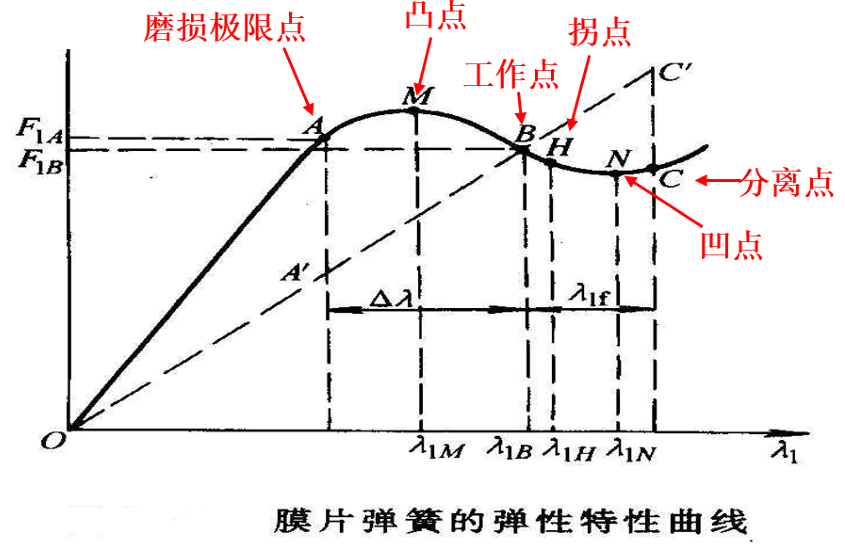

# 汽车整体设计

## ==进行总体设计应满足的基本要求==

1. ==汽车的各项性能、成本指标要达到企业在产品规划时所确定的目标。==
2. ==严格遵守和贯彻有关法规和标准，同时注意不要侵犯知识产权。==
3. ==深入贯彻标准化、通用化和系列化，大力推进平台化、模块化和集成化。==
4. ==进行相关运动学校核，保证汽车有正确的运动并且避免发生运动干涉。==
5. ==保证汽车拆装和维修方便，可报废回收利用，具有环境友好性。==

## ==不足转向、中性转向和过度转向==

==假设一辆车围绕一个直径$40\mathrm{m}$的圆做匀速圆周运动，驶入圆周进入稳定的匀速状态以后，驾驶者只要握住方向盘保持一个固定的角度就可以了。若在此时保持其他条件不变而缓慢加大油门，车辆可能会有三种不同的反应。==

1. ==车辆离开圆周向外侧偏离，运动半径增大，即为不足转向；==
2. ==车辆离开圆周向内侧偏离，运动半径减小，即为过度转向；==
3. ==车辆没有发生偏离，仍然保持围绕圆周行驶，运动半径不变，即为中性转向；==

## 轴距$L$

==轴距$L$**减小**会影响：==

- ==整备质量**减小**==
- ==汽车总长**减小**==
- ==汽车最小转弯直径**减小**==
- ==传动轴长度**减小**==
- ==纵向通过半径**减小**==
- ==轴荷分配==
- ==传动轴夹角==

==轴距过短会使：==

- ==车厢长度不足或后悬过长==
- ==汽车上坡、制动或加速时轴荷转移过大，使汽车制动性或操纵稳定性变坏==
- ==车身纵向角振动增大，对平顺性不利==
- ==万向节传动轴的夹角增大==

## 轮距$B$

==受汽车总宽不得超过$2.5\mathrm{m}$限制，轮距不宜过大。==

### 前轮距$B_1$

==应能布置下发动机、车架、前悬架和前轮，并保证前轮有足够的转向空间，同时转向杆系与车架、车轮之间有足够的运动间隙。==

### 后轮距$B_2$

==应考虑车架两纵梁之间的宽度、悬架宽度和轮胎宽度及它们之间应留有必要的间隙。==

## 前悬$L_F$和后悬$L_R$

==前悬$L_F$增加：==

1. ==安全性提高==
2. ==前钢板弹簧长度增加==
3. ==驾驶员视野变坏==
4. ==接近角减小，通过性下降==

## 质量系数$\eta_\mathrm{m0}$

==定义：汽车**装载质量**$m_\mathrm{e}$与**整车整备质量**$m_0$的比值，$\eta_\mathrm{m0}=\frac{m_\mathrm{e}}{m_0}$==

## 动力性能参数

1. ==最高车速==

2. ==加速时间$t$==

   汽车在平直的良好路面上，从原地起步开始以最大加速度加速到一定车速所用去的时间

3. 上坡能力
   用汽车满载时在良好路面上的最大坡度阻力系数 $i_\mathrm{max}$来表示汽车的上坡能力。

4. 比功率$P_\mathrm{b}$和比转矩$T_\mathrm{b}$
   比功率$P_\mathrm{b}$是汽车所装发动机的标定最大功率$P_\mathrm{emax}$与汽车最大总质量$m_\mathrm{a}$之比。即$P_\mathrm{b}=\frac{P_\mathrm{emax}}{m_\mathrm{a}}$。
   比转矩$T_\mathrm{b}$，是汽车所装发动机的最大转矩$T_\mathrm{emax}$与汽车总质量$m_\mathrm{a}$之比，即$T=\frac{T_\mathrm{emax}}{m_\mathrm{a}}$。它能反映汽车的牵引能力。

# 离合器设计

## 功用

1. ==切断和实现发动机对传动系的动力传递，保证汽车起步时将发动机与传动系平稳地结合，确保汽车平稳起步==
2. ==在换挡时将发动机与传动系分离，减少变速器中换挡齿轮之间的冲击==
3. 工作中受到较大动载荷时，能限制传动系所承受的最大转矩，以防止传动系各零部件因过载而损坏
4. 有效的降低传动系的振动和噪声

## 压紧弹簧布置形式的选择

### 膜片弹簧离合器

==是一种由**弹簧钢**制成的具有特殊结构的**碟形弹簧**，主要由**碟簧部分**和**分离指部分**组成。==

#### 优点：

1. ==有较理想的非线性弹性特性，弹黄压紧力在衬片磨损范围内基本不变，因而传递转矩大致不变。==
2. ==兼起压紧弹簧和分离杠杆的作用，结构简单紧凑，零件数目少，质量小。==
3. 高速旋转时压紧力下降极小，性能稳定。
4. 压力分布均匀，摩擦片磨损均匀。
5. 通风散热好，使用寿命长。
6. 膜片弹簧中心与离合器中心重合，平衡性好。

#### 缺点：

1. 制造工艺复杂，成本高，对材质和精度要求高。
2. 非线性特性不易控制，开口易裂纹，端部易磨损。

## 摩擦片外径$D$、内径$d$和厚度

当$D$确定后，$d$可按$\frac{d}{D}$在$0.53 \sim 0.70$来确定；

==$D$不变时，若$d$取小时：摩擦面积增加，离合器静摩擦力矩$T_c$增加；但压力分布不均匀，且使摩擦片内外缘圆周速度差别太大而造成摩擦不均匀；不利于散热和扭转减振器的安装。==

==所选$D$，应使摩擦片最大圆周速度不超过$65-70\mathrm{m/s}$，以免摩擦片发生飞离。==

## 摩擦半径

### 平均摩擦半径$R_m$

平均摩擦半径是指圆盘离合器和盘式制动器中，摩擦面最大半径（$R$）和最小半径（$r$）的平均值，计算公式为：
$$
R_m= \frac{R + r}{2}
$$
这个概念在机械工程（一级学科），摩擦学（二级学科），摩擦（三级学科）中有所应用。

### 有效摩擦半径$R_c$

有效摩擦半径是指在计算离合器的静摩擦力矩时，考虑到摩擦片的外径（$D$）和内径（$d$）的影响，所定义的一个半径值。有效摩擦半径（$R_\mathrm{c}$）可以根据以下公式计算：
$$
R_\mathrm{c} = \frac{D^3 - d^3}{3(D^2 - d^2)}
$$
当摩擦片内外径之比（$\frac{d}{D}$）大于或等于$0.6$时，有效摩擦半径可以相当准确地由下式计算：
$$
R_\mathrm{c} = \frac{D + d}{4}
$$
这个参数对于计算离合器的静摩擦力矩非常重要，因为它涉及到摩擦力的传递效率和离合器的设计。

总结来说，平均摩擦半径是摩擦面最大和最小半径的平均值，而有效摩擦半径则是在计算离合器静摩擦力矩时考虑的一个更为具体的参数，它依赖于摩擦片的外径和内径。这两个参数对于离合器的设计和性能分析都是至关重要的。

### ==大小关系==

==在大多数情况下，有效摩擦半径（$R_\mathrm{c}$）会比平均摩擦半径（$R_m$）小。==这是因为有效摩擦半径的计算考虑了摩擦片的外径和内径的影响，而平均摩擦半径仅仅是外径和内径的算术平均值。

## 离合器的后备系数$\beta$

==离合器所能传递的最大静摩擦力矩与发动机最大转矩之比==

$$
\beta = \frac{T_\mathrm{c}}{T_{\mathrm{emax}}}
$$

## 约束条件

==汽车起步时，离合器接合一次，从分离状态到完全同步状态期间，由于离合器的滑动摩擦所消耗掉的功即为**滑磨功**$W（J）$==，可根据下式计算：

$$
W=\frac{\pi^2 n_\mathrm{e}^2}{1800} \left( \frac{m_\mathrm{a} r_\mathrm{r}^2}{i_0^2 i_\mathrm{g}^2} \right)
$$

|      变量      | 含义                                                         |
| :------------: | :----------------------------------------------------------- |
| $m_\mathrm{a}$ | 为汽车总质量（$\mathrm{kg}$）                                |
| $r_\mathrm{r}$ | 轮胎滚动半径（$\mathrm{m}$）                                 |
| $i_\mathrm{g}$ | 汽车起步时所用变速器挡位的传动比                             |
|     $i_0$      | 主减速器传动比                                               |
| $n_\mathrm{e}$ | 发动机转速（$\mathrm{r/min}$），计算时乘用车取$2000\mathrm{r/min}$，商用车取$1500\mathrm{r/min}$ |

## 膜片弹簧工作点位置选择

### 横坐标$\lambda_1$是什么？

==加载点间的相对轴向变形为$\lambda_1$（$\mathrm{mm}$)==

### 纵坐标$F_1$是什么？

==通过支承环和压盘施加在膜片弹簧上的载荷$F_1$（$\mathrm{N}$）集中在支承点处==

==**拐点**$H$对应着膜片弹簧**压平的位置**，$\lambda_{1\mathrm{H}}=\frac{\lambda_{1\mathrm{M}}+\lambda_{1\mathrm{N}}}{2}$==

==新离合器接合状态时，**工作点**$B$取在凸点$M$和拐点$H$之间，且靠近$H$点处，$\lambda_{\mathrm{1B}}=(0.8 \sim 1.0)\times \lambda_{\mathrm{1H}}$，以保证在**最大磨损限度**$\Delta A$内压紧力从$F_{\mathrm{1B}}$到$F_{\mathrm{1A}}$变化不大。==

==当分离时，工作点由$B$变到$C$。为最大限度减小踏板力，$C$点应靠近凹点$N$处==

## 扭转角刚度$k_\varphi$

==为了避免引起传动系统的共振，要合理选择减振器的扭转角刚度$k_\varphi$，使共振现象不发生在发动机常用的工作转速范围内。==$k_\varphi$决定于减振弹簧的线刚度及其结构布置尺寸。

## 阻尼摩擦转矩$T_\mu$

由于减振器扭转刚度$k_\varphi$受结构及发动机最大转矩的限制不可能很低，故==为了在发动机工作转速范围内**最有效地消除扭转振动**，必须合理选择减振器阻尼装置的阻尼摩擦转矩==。

## ==离合器操纵机构的设计计算==

### ==踏板行程$S$==

==踏板行程由**自由行程**$S_1$和**工作行程**$S_2$两部分组成，即：==
$$
S=S_1+S_2=\left( S_{of}+Z\Delta S\frac{c_2}{c_2} \right)\frac{a_2 b_2 d_2^2}{a_1 b_1 d_1^2}
$$

==式中:==

- ==$S_{of}$为分离轴承的自由行程，一般为$1.5 \sim 3.0 \mathrm{mm}$，反映到踏板上的自由行程$S_1$一般为$20 \sim 30 \mathrm{mm}$==
- ==$d_1$、$d_2$分别为主缸和工作缸的直径==
- ==$Z$为摩擦片面数==
- ==$\Delta S$为离合器分离时对偶摩擦面间的间隙，单片：$\Delta S=0.85 \sim 1.30\mathrm{mm}$，双片：$\Delta S=0.75 \sim 0.90\mathrm{mm}$==
- ==$a_1$、$a_2$、$b_1$、$b_2$、$c_1$、$c_2$为杠杆尺寸==

### ==踏板力$F_f$==

$$
F_f=\frac{F'}{i_\Sigma \eta}+F_s
$$

==式中：==

- ==$F'$为离合器分离时，压紧弹簧对压盘的总压力==
- ==$i_\Sigma$为操纵机构总传动比，$i_Sigma=\frac{a_2 b_2 c_2 d_2^2}{a_1 b_1 c_1 d_1^2}$==
- ==$\eta$为机械效率，液压式：$\eta=80\% \sim 90\%$，机械式：$n=70\%  \sim 80\%$==
- ==$F_\mathrm{s}$为克服回位弹簧$1$、$2$的拉力所需的踏板力，在初步设计时，可忽略不计。==

### ==不考虑回位弹簧的作用，分离离合器所作的功$W_\mathrm{L}$==

$$
W_\mathrm{L}=\frac{0.5}{\eta}(F_1+F')Z\Delta S
$$

==式中：$F_1$为离合器接合状态下压紧弹簧的总压紧力==

# 机械式变速器设计

==从变速器输入端向后看，倒挡齿轮位于一二轴(或输出轴与中间轴)中心线**右侧**，**倒挡轴受力较小**。==

==两种布置形式倒挡惰轮的受力分析如图所示。从图示可知，图a的布置方案惰轮轴所受的径向合力较大，但是合力方向指向远离中间轴和输出轴齿轮方向，这样工作中避免轮齿咬死。**图b的布置方案惰轮轴所受的径向合力较小，但是合力方向指向靠近中间轴和输出轴齿轮方向，这样工作中容易造成轮齿咬死，应尽量避免。**==

## 问题1：1挡齿轮为何靠近箱体处?

1挡齿轮受力大，靠近箱体可使轴的变形较小。

## ==问题2：1轴上的常啮合齿轮为何是左旋?==

==可使1轴受力朝左，就近把常啮合齿轮所受的力通过1轴轴承传到箱体上，防止与2轴咬死。==

## 轴承的选择

- ==第一轴常啮合齿轮的内腔尺寸足够时，可布置**圆柱滚子轴承**，若空间不足则采用**滚针轴承**。==
- 变速器第一轴、第二轴的后部轴承以及中间轴前、后轴承，按直径系列般选用中系列**球轴承**或**圆柱滚子轴承**。
- **滚针轴承**、**滑动轴套**主要用在齿轮与轴不是固定连接，并要求两者有相对运动的地方。

## 挡数

- ==对于商用车而言，**比功率较小**，因而变速器各挡位传动比多按**等比级数**进行分配==，以有效避免名挡位的重叠
- ==对于乘用车，因中高挡位的使用率较高，变速器多采用**渐变传动比**进行设计==，**挡位越高，相邻挡位之间的传动比比值（低挡比高挡）越小**。

## 齿轮参数

### 变位系数

#### ==齿轮变位的目的==

1. ==消除齿轮根切现象，提高抗弯强度==
2. ==配凑中心距$A$，要求中间轴、第二轴上各对齿轮的中心距必须相同。在模数已定时，为满足传动比的需要，各对齿轮的中心距（齿数和）可能不相同，要配凑中心距。==
3. ==改善接触强度，使传动平稳、耐磨损，并降低合噪声。==

## ==各挡齿数的分配==

==初选中心距$A$、齿轮模数$m$和螺旋角$\beta$以后，可根据变速器的挡数、传动比和传动方案来分配各挡齿轮的齿数。==

 

### ==确定一挡齿轮的齿数==

==传动路线：$输入轴 \to z_1 \to z_2 \to z_{11} \to z_{12} \to 输出轴$==

==一档传动比==

$$
i_1=\frac{z_2 z_{12}}{z_1 z_{11}} \tag{3-4} \label{3-4}
$$

==如果$z_{11}$和$z_{12}$的齿数确定了，则$z_1$与$z_2$的传动比可求出。为了求$z_{11}$和$z_{12}$的齿数，先求齿数和$z_\mathrm{h}$==

- ==直齿：$z_\mathrm{h}=\frac{2A}{m}$==
- ==斜齿：$z_\mathrm{h}=\frac{2A \cos \beta}{m_n}$==

==计算后齿数$z_\mathrm{h}$取整，然后进行大小齿数的分配。==

中间轴上$1$挡小齿轮的齿数尽可能取小些，以便使$\frac{z_{12}}{z_{11}}$的传动比大些。

在$i_1$**已定**的条件下，$\frac{z_2}{z_1}$的传动比可分配小些，**使第一轴常啮合齿轮的齿数多些**，便于在$z_1$内装第二轴的前轴承，并使齿轮轮辐有足够的厚度。考虑到第一轴轴承孔尺寸的限制和装配的可能性，该齿轮齿数又不宜取多。

中间轴上小齿轮$11$的最少齿数，受中间轴轴径尺寸限制，不能太小。对于中间轴式变速器：$z_{11}$可取$15 \sim 17$（乘用车）；$z_{11}$可取$12 \sim 17$（商用车）

一挡大齿轮齿数计算$z_{12}=z_\mathrm{h}-z_{11}$

==选择齿数时，尽量使**相配合的齿轮齿数互为质数**，以免引起齿面的**不均匀磨损**。==

假设小齿轮和大齿轮分别是10齿和20齿，显然这是不互质的齿数组合。那么如果装配时小齿轮的1号齿与大齿轮的1号齿相啮合，那么在今后的运行过程中，小齿轮1号齿永远只会和大齿轮的1号以及11号齿啮合，没有机会啮合到其他齿。如果小齿轮的1号齿有加工缺陷，那么大齿轮的1号和11号齿容易受到冲击和损，机器也会产生有规律的振动和脉动，长此以往**这3个齿也会提早失效**。

假设我们将大齿轮齿数减小到19齿，此时齿数互质同样观察小齿轮的1号齿，依次与其啮合的大齿轮轮齿序号为1，11，2，12，3，13…可以看到整个齿轮副所有齿都有机会相互啮合，这样**可以分散加工误差带来的磨损和传动性能损失**。

### ==对中心距A进行修正==

==修正$A$的原因：齿数和$z_\mathrm{h}$被圆整过，经过取整数使中心距有了变化。==

==根据齿数和、变位系数等重新计算$A$（精确到小数点后两位）。再**以修正后的**$A$作为其余各挡齿轮齿数**分配的依据**。**此后，$A$不再变动**。==

### ==确定常啮合传动齿轮副的齿数$z_1$、$z_2$==

==由式$\eqref{3-4}$求出常啮合传动齿轮的传动比：==
$$
\frac{z_2}{z_1}=i_1 \frac{z_{11}}{z_{12}}
$$

==而常啮合传动齿轮的中心距与一挡齿轮的中心距相等，即：==
$$
A=\frac{m_n(z_1+z_2)}{2 \cos \beta_2}\tag{3-7} \label{3-7}
$$

==根据上式求得$z_1$、$z_2$，再进行圆整。然后用式$\eqref{3-4}$核算一挡传动比与原传动比区别，如相差较大，则调整一下齿数即可。根据确定的齿数按式$\eqref{3-7}$重新核算螺旋角$\beta$值，其值应在前述的选择范围内。==

==此外，也可在保证预选的$\beta_2$的前提下，通过齿轮变位来满足中心距的要求。==

### 确定其他各挡的齿数

$输入轴 \to z_1 \to z_2 \to z_8 \to z_7 \to 输出轴$

==设二挡齿轮为**直齿**，模数与一挡齿轮相同，则==

$$
i_2=\frac{z_2 z_7}{z_1 z_8}\tag{3-8} \label{3-8}
$$

$$
A=\frac{M_n(z_7+z_8)}{2}\tag{3-9}
$$

==根据上式可求得$z_7$、$z_8$，然后齿数取整核算中心距。若中心距有偏差，可通过齿轮变位调整。==

==若二挡齿轮为**斜齿**，螺旋角$\beta_8$与常啮合齿$\beta_2$不同，由式$\eqref{3-8}$得：==
$$
\frac{z_7}{z_8}=i_2\frac{z_1}{z_2}\tag{3-10}\label{3-10}
$$

$$
A=\frac{m_n(z_7+z_8)}{2\cos \beta_8}\tag{3-11}\label{3-11}
$$

==此外，从抵消或减少中间轴上的轴向力出发，还需满足：==

$$
\frac{\tan \beta_2}{\tan\beta_8}=\frac{r_2}{r_8}\tag{3-12}
$$

==而==

$$
\frac{r_2}{r_8}=\frac{m_n z_2}{\cos \beta_2}\frac{\cos\beta_8}{m_n z_8}=\frac{z_2}{z_8}\frac{\cos\beta_8}{\cos\beta_2}
$$

==分度圆直径：==

$$
d=m_tz=\frac{m_nz}{\cos \beta}
$$
==整理可得：==

$$
\frac{\sin\beta_2}{\sin\beta_8}=\frac{z_2}{z_8}\tag{3-13}\label{3-13}
$$

==联立$\eqref{3-10}$、式$\eqref{3-11}$和式$\eqref{3-13}$，可求得$z_7$、$z_8$、$\beta_8$。==

==此外，也可通过**试凑法**，即先选定螺旋角$\beta_8$，联立式$\eqref{3-10}$和式$\eqref{3-11}$，求出$z_7$、$z_8$；再将$z_7$、$z_8$代入式$\eqref{3-13}$中，检查是否满足或近似满足轴向力平衡的关系。==

==如相差太大，则需调整螺旋角$\beta_8$。重复上述过程，直至符合设计要求为止。其他各挡齿轮齿数也可用上述方法确定。==

各挡动力传递路线：

- 三挡：$输入轴 \to z_1 \to z_2 \to z_6 \to z_5 \to 输出轴$
- 四挡：$输入轴 \to 输出轴$（无需配齿）
- 五挡：$输入轴 \to z_1 \to z_2 \to z_4  \to z_3 \to 输出轴$

### 确定倒挡齿轮的齿数

==**倒挡齿轮模数往往与一挡相近**。由[图](#pic)所示倒挡齿轮$10$的齿数，一般为$z_{10}=21 \sim 23$==

==初选$z_{10}$后，可根据$z_9$与$z_{10}$互为质数且$z_9$小于$z_{10}$的原则选择$z_9$。此时可计算倒挡轴与中间轴距离：==
$$
A'=m\frac{(Z_9+Z_{10})}{2}
$$

==根据前边计算结果，$A$、$A'$和齿轮$12$的齿数已知，选择齿轮$13$合适的齿数$z_{13}$，此处注意$z_{13}$应该小于$z_{10}$。==

==计算倒挡轴与输出轴距离：$A''=\frac{m(z_{12}+z_{13})}{2}$。此处选择的$z_{13}$需**保证**$\boldsymbol{A'+A'' > A}$，且倒挡齿轮具有合理的装配关系。==

## 齿轮的损坏形式

轮齿折断、齿面疲劳剥落（点蚀）、移动换挡齿轮端部破坏、齿面胶合。

**轮齿折断发生在下述几种情况下**：轮齿受到足够大的冲击载荷作用，造成轮齿弯曲折断;轮齿在重复载荷作用下，齿根产生疲劳裂纹，裂纹扩展深度逐渐加大，然后出现弯曲折断。**前者在变速器中出现得极少，而后者出现得多些。**

==轮齿工作时，一对齿轮相互暗合，齿面相互挤压，这时存在于齿面细小裂缝中的润滑油油压升高，并导致裂缝扩展，然后齿面表层出现块状剥落而形成小麻点，称之为**齿面点蚀**。==它使齿形误差加大，产生动载荷，并可能导致轮齿折断。

用**移动齿轮的方法完成换挡**的低挡和倒挡齿轮，由于换挡时两个进入合的齿轮存在角速度差，换挡瞬间在轮齿端部产生冲击载荷，并造成损坏。

==负荷大、齿面相对滑动速度又高的齿轮，在**接触压力大且接触处产生高温作用**的情况下使齿面间的润滑油膜破坏，导致齿面直接接触，在局部高温、高压作用下齿面互相粘连，齿面沿滑动方向形成撕伤痕迹，称为**齿面胶合**。==变速器齿轮的这种破坏出现较少。

